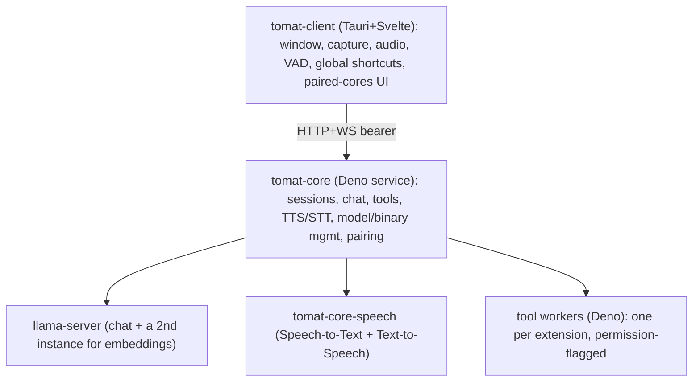

# Developing tomat

This document covers tomat's architecture and how to build and run it from
source. For the project's contribution policy, see
[CONTRIBUTING.md](CONTRIBUTING.md). Each package has its own README with the
deeper detail; this file stays at the getting-started level.

tomat is a local-first modular AI client. **tomat** runs the LLM,
speech-to-text, text-to-speech, and tool execution as a long-running service
(`tomat-core`) that can sit on the same machine as the UI or on a different one
(e.g. your gaming PC). The desktop client (`tomat-client`) is a small
Svelte+Tauri app that talks to one or more paired cores over an HTTP+WS API.

## Architecture at a glance



**Packages** (each links to its own README for layout and internals):

- [`packages/tomat-shared/`](packages/tomat-shared/README.md): TypeScript
  types + Zod schemas (API contract, `tomat.json` schema, WS frame discriminated
  unions).
- [`packages/tomat-core/`](packages/tomat-core/README.md): Deno service, single
  SQLite DB, all sidecar supervision, npm-based extension installation,
  in-process embeddings.
- [`packages/tomat-core-updater/`](packages/tomat-core-updater/README.md):
  standalone Rust binary that swaps in a staged core build during self-update,
  then restarts core.
- [`packages/tomat-core-keychain/`](packages/tomat-core-keychain/README.md):
  native Rust helper that stores the core's master key in the OS keychain over a
  stdio protocol.
- [`packages/tomat-core-hwinfo/`](packages/tomat-core-hwinfo/README.md): native
  Rust helper that reports RAM, physical cores, and GPU/VRAM for the on-device
  model fit engine.
- [`packages/tomat-core-ptyhost/`](packages/tomat-core-ptyhost/README.md):
  native Rust helper that runs a tool worker under a pseudo-terminal so Deno's
  runtime permission prompts can pause the tool and be answered from chat (unix
  only for now; Windows falls back to `--no-prompt` workers).

These four helper binaries (updater, keychain, hwinfo, ptyhost) ship in the
signed release manifest and are placed in the bin dir at install time. Core
verifies they are present at boot and **refuses to start** if any are missing,
rather than silently degrading (file-backed secrets, guessed hardware, tool
workers without permission prompts). `deno task dev` builds them from source and
links them into the dev bin dir before core boots, so dev matches a real
install; a build failure surfaces in the dev log and core declines to start.

- [`packages/tomat-client/`](packages/tomat-client/README.md): Tauri 2 + Svelte
  5 + Vite + UnoCSS desktop UI.
- [`packages/tomat-model-catalog/`](packages/tomat-model-catalog/README.md):
  hand-authored source for the signed model catalog that drives the model
  pickers in Settings.
- [`packages/tomat-builtin/`](packages/tomat-builtin/README.md): the extension
  bundled with core; also a reference implementation of the `tomat.json` format
  and the extension author docs.
- [`packages/tomat-website/`](packages/tomat-website/README.md): Astro site
  behind `au.tomat.ing` (landing page only), plus the release + deploy pipeline
  for the artifacts served from `get.au.tomat.ing`.

## Setup

### Prerequisites

- **Deno 2.8+** (`brew install deno` / `winget install DenoLand.Deno` / see
  https://deno.com/).
- **Rust toolchain** for building the Tauri shell and the core-keychain helper
  (`packages/tomat-client/src/tauri/rust-toolchain.toml` pins the version).
- **Cargo + Tauri 2 prerequisites**: see
  https://v2.tauri.app/start/prerequisites/. On Debian/Ubuntu the full set
  (Tauri/webkit, PipeWire + ALSA for capture/audio, libsecret for the keychain
  helper) is:

  ```bash
  sudo apt-get install -y \
    libwebkit2gtk-4.1-dev libappindicator3-dev librsvg2-dev \
    libsoup-3.0-dev libpipewire-0.3-dev libasound2-dev \
    libsecret-1-dev patchelf
  ```

### First-time setup

```bash
deno install        # populates node_modules + warms the Deno npm cache
deno --version      # expect 2.8+
cargo --version     # expect 1.96.0 (pinned by rust-toolchain.toml)
```

`.env` at the repo root is **release-only** (manifest signing + Cloudflare/R2
credentials); it is **not** needed for `deno task dev` or `deno task test`. See
`.env.example` if you're setting up the release pipeline.

## Development loop

```bash
deno task dev       # spawns core (deno --watch) + client (tauri dev) together
```

The core listens on `127.0.0.1:7800` and the client UI runs at
`http://localhost:1420`. Output from each is prefixed `[core]` / `[client]`, and
`deno task dev` also prints a `[dev]` banner with a pairing code (below).

### Connecting the client to the dev core

`deno task dev` runs the core from source, seeds a dev admin token at
`~/.tomat/dev/core/.admin-token`, and prints a pairing code. In the client's
first-run screen choose **"On another computer"**, enter the URL
`http://127.0.0.1:7800`, and paste the printed code. The pairing persists across
dev restarts. **Do not** click "On this computer" in dev. That path runs the
production installer (it looks for a compiled core binary, which dev never
builds) and would install a stable core over your dev session.

### Building

```bash
deno task build         # build everything that changed (core/client/catalog/website) for the latest channel
deno task build:stable  # ... for the stable channel
```

`deno task build` compiles each artifact whose source changed since the last
build and skips the rest (tracked by a `dist/.build-state.json` cursor). Run
`deno task clean` or pass `--force` to rebuild from scratch. The granular
`build:core` / `build:client` tasks force-build a single component. Releasing
the built artifacts is covered in
[packages/tomat-website/README.md](packages/tomat-website/README.md).

### Working on one package

The integrated `deno task dev` runs core + client together, but each package can
also be developed in isolation. Every package exposes a standardized verb set in
its own `deno.json` (`check`, `test`, and where they apply `dev` / `build`),
reachable two ways:

```bash
deno task check:core            # run one package's verb from the repo root (<verb>:<pkg>)
cd packages/tomat-core && deno task check   # or from inside the package
```

`dev:core`, `dev:client`, and `dev:website` start a single component's dev loop.
The client's `dev` is the full Tauri shell; it runs the Vite frontend server
itself through the Tauri `beforeDevCommand` (inlined in `tauri.conf.json`), so
there is no separate Vite-only verb to confuse with `dev:website`. The five Rust
helper crates expose the same verbs as cargo wrappers, so
`deno task check:core-keychain` and
`cd packages/tomat-core-keychain && deno
task lint` work identically to the Deno
packages.

## Packages and release items

The repo separates two axes that used to be tangled in the root task list:

- A **package** is a unit of development: a workspace member with the
  standardized verbs above. The 11 packages are the `workspace` array in the
  root `deno.json` (6 Deno + 5 Rust crates), the single source of truth for the
  fan-out (`scripts/pkg.ts`).
- A **release item** is a unit of distribution and may compose several packages.
  `core` bundles `tomat-core`, `tomat-shared`, and the native helper crates;
  `client` and `website` each pull `tomat-shared`. Release items live in
  `scripts/release/*.ts`; each declares the `packages` it is built from, and the
  ones whose source hash is "each package's src + manifest" derive that hash
  from the package list so it cannot drift. Releasing is covered in
  [packages/tomat-website/README.md](packages/tomat-website/README.md).

### Cleaning build artifacts

```bash
deno task clean               # dist, target, build, .svelte-kit, .astro, .wrangler
deno task clean --deep        # also node_modules + the Deno cache (re-run deno install)
deno task clean --dev-state    # also ~/.tomat/dev (the isolated dev channel)
deno task clean --latest-state # also ~/.tomat/latest (the isolated latest channel)
```

## Channels

State is namespaced by install channel via `TOMAT_CHANNEL`, so a dev or latest
build never collides with a stable install:

| `TOMAT_CHANNEL`  | data under         | keychain              |
| ---------------- | ------------------ | --------------------- |
| unset / `stable` | `~/.tomat/stable/` | `tomat-client`        |
| `dev`            | `~/.tomat/dev/`    | `tomat-client-dev`    |
| `latest`         | `~/.tomat/latest/` | `tomat-client-latest` |

`deno task dev` sets `dev` automatically. Models are the one exception: they
stay shared at `~/.tomat/models` so multi-GB weights aren't re-downloaded per
channel. Reset dev state with `deno task clean --dev-state` (or
`rm -rf ~/.tomat/dev`); it never touches a stable install. How core stores
secrets in dev (and how not to lose them) is covered in
[packages/tomat-core/README.md](packages/tomat-core/README.md).

Channels are built to **coexist and run at the same time**, not just isolate
data: binaries get a channel suffix (`tomat-core` → `tomat-core-latest`), the
desktop app is a distinct bundle, service labels are suffixed, and default ports
are offset so two cores can bind at once:

| channel | core | llama (`llm.port`) | speech | embed |
| ------- | ---- | ------------------ | ------ | ----- |
| stable  | 7800 | 7701               | 7702   | 7703  |
| latest  | 7810 | 7711               | 7712   | 7713  |
| dev     | 7820 | 7721               | 7722   | 7723  |

(Explicit settings still win; only the defaults shift.)

Building and releasing (to the latest or stable channel) is covered in
[packages/tomat-website/README.md](packages/tomat-website/README.md), the
release + deploy doc.

## External dependencies

The model catalog and the manifest / update / binary-download paths bet on
third-party contracts (HuggingFace URLs and headers, GitHub release shapes and
asset names, upstream archives) that can change under us. When a download or a
release build breaks and you suspect a third party moved something, start at the
break-glass reference [EXTERNAL.md](EXTERNAL.md): it maps each external
touchpoint to the code that relies on it, the symptom, and the fix.

## Type-check + format + lint

```bash
deno task check     # deno check / svelte-check + cargo check, fanned across packages
deno task fmt       # oxfmt (all TS/JS/JSON/MD) + cargo fmt per crate
deno task lint      # oxlint (incl. no-tauri-import) + .svelte tauri grep + shared-UI walkers (purity / view-coverage / component-tiers) + cargo clippy
```

Each aggregate fans the same-named verb out across the packages that define it
(see [Packages and release items](#packages-and-release-items)). `fmt` and
`lint` run oxfmt/oxlint once over the whole tree (they also cover root-level
files) and add `cargo fmt`/`clippy` per Rust crate; `check` runs each package's
own check.

## Tests

```bash
deno task test          # every package's tests (deno test + vitest + cargo test)
deno task test:client   # just the client (vitest + the Tauri crate's cargo test)
deno task test:core     # just tomat-core
deno task test:e2e      # WebdriverIO E2E (manual, opt-in)
```

Tests are co-located with source as `*.test.ts`. E2E specs live under
`tests/e2e/specs/` with their own runner; see
[tests/e2e/README.md](tests/e2e/README.md) for setup. Scratch tests are
`*.tmp.test.ts` (gitignored anywhere in the tree). The developer guide for the
suite (helpers, fixtures, mocking patterns) is in
[tests/README.md](tests/README.md).
