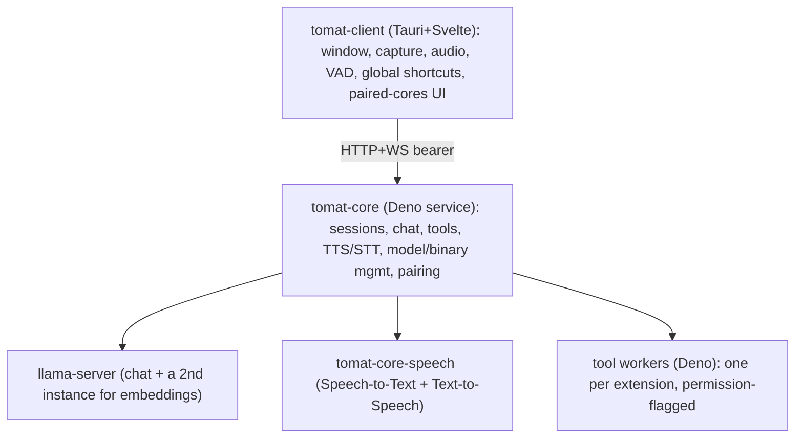

# Developing tomat

This document covers tomat's architecture and how to build and run it from
source. For the project's contribution policy, see
[CONTRIBUTING.md](CONTRIBUTING.md). Each package has its own README with the
deeper detail; this file stays at the getting-started level.

tomat is a local-first modular AI client. **tomat** runs the LLM,
speech-to-text, text-to-speech, and tool execution as a long-running service
(`tomat-core`) that can sit on the same machine as the UI or on a different one
(e.g. your gaming PC). The desktop client (`tomat-client`) is a small
Svelte+Tauri app that talks to one or more paired cores over an HTTP+WS API.

## Architecture at a glance



**Packages** (each links to its own README for layout and internals):

- [`packages/tomat-shared/`](packages/tomat-shared/README.md): TypeScript
  types + Zod schemas (API contract, `tomat.json` schema, WS frame discriminated
  unions).
- [`packages/tomat-core/`](packages/tomat-core/README.md): Deno service, single
  SQLite DB, all sidecar supervision, npm-based extension installation,
  in-process embeddings.
- [`packages/tomat-core-updater/`](packages/tomat-core-updater/README.md):
  standalone Rust binary that swaps in a staged core build during self-update,
  then restarts core.
- [`packages/tomat-core-keychain/`](packages/tomat-core-keychain/README.md):
  native Rust helper that stores the core's master key in the OS keychain over a
  stdio protocol.
- [`packages/tomat-core-hwinfo/`](packages/tomat-core-hwinfo/README.md): native
  Rust helper that reports RAM, physical cores, and GPU/VRAM for the on-device
  model fit engine.
- [`packages/tomat-core-ptyhost/`](packages/tomat-core-ptyhost/README.md):
  native Rust helper that runs a tool worker under a pseudo-terminal so Deno's
  runtime permission prompts can pause the tool and be answered from chat (unix
  only for now; Windows falls back to `--no-prompt` workers).

These four helper binaries (updater, keychain, hwinfo, ptyhost) ship in the
signed release manifest and are placed in the bin dir at install time. Core
verifies they are present at boot and **refuses to start** if any are missing,
rather than silently degrading (file-backed secrets, guessed hardware, tool
workers without permission prompts). `deno task dev` builds them from source and
links them into the dev bin dir before core boots, so dev matches a real
install; a build failure surfaces in the dev log and core declines to start.

- [`packages/tomat-client/`](packages/tomat-client/README.md): Tauri 2 + Svelte
  5 + Vite + UnoCSS desktop UI.
- [`packages/tomat-model-catalog/`](packages/tomat-model-catalog/README.md):
  hand-authored source for the signed model catalog that drives the model
  pickers in Settings.
- [`packages/tomat-extension-builtin/`](packages/tomat-extension-builtin/README.md):
  the extension bundled with core; also a reference implementation of the
  `tomat.json` format and the extension author docs.
- [`packages/tomat-extension-samples/`](packages/tomat-extension-samples/README.md):
  dev-only capability showcase exercising the full `tomat.json` surface; not
  released to production, only codebase-installed in the dev environment.
- [`packages/tomat-website/`](packages/tomat-website/README.md): Astro site
  behind `au.tomat.ing` (landing page only), plus the release + deploy pipeline
  for the artifacts served from `get.au.tomat.ing`.

## Setup

### Prerequisites

- **Deno 2.8+** (`brew install deno` / `winget install DenoLand.Deno` / see
  https://deno.com/).
- **Rust toolchain** for building the Tauri shell and the core-keychain helper
  (`packages/tomat-client/src/tauri/rust-toolchain.toml` pins the version).
- **Cargo + Tauri 2 prerequisites**: see
  https://v2.tauri.app/start/prerequisites/. On Debian/Ubuntu the full set
  (Tauri/webkit, PipeWire + ALSA for capture/audio, libsecret for the keychain
  helper) is:

  ```bash
  sudo apt-get install -y \
    libwebkit2gtk-4.1-dev libappindicator3-dev librsvg2-dev \
    libsoup-3.0-dev libpipewire-0.3-dev libasound2-dev \
    libsecret-1-dev patchelf
  ```

- **shellcheck** for linting the shell install scripts (`brew install shellcheck`
  / `apt install shellcheck`). `deno task lint` runs it over `scripts/**/*.sh`;
  when it is absent the check skips with a warning locally, but CI installs it so
  the check is enforced.

### First-time setup

```bash
deno install        # populates node_modules + warms the Deno npm cache
deno --version      # expect 2.8+
cargo --version     # expect 1.96.0 (pinned by rust-toolchain.toml)
```

`.env` at the repo root is **release-only** (manifest signing + Cloudflare/R2
credentials); it is **not** needed for `deno task dev` or `deno task test`. See
`.env.example` if you're setting up the release pipeline.

## Development loop

```bash
deno task dev       # spawns core (deno --watch) + client (tauri dev) together
```

The core listens on `127.0.0.1:7800` and the client UI runs at
`http://localhost:1420`. Output from each is prefixed `[core]` / `[client]`, and
`deno task dev` also prints a `[dev]` banner with a pairing code (below).

### Connecting the client to the dev core

`deno task dev` runs the core from source, seeds a dev admin token at
`~/.tomat/dev/core/.admin-token`, and prints a pairing code. In the client's
first-run screen choose **"On another computer"**, enter the URL
`http://127.0.0.1:7800`, and paste the printed code. The pairing persists across
dev restarts. **Do not** click "On this computer" in dev. That path runs the
production installer (it looks for a compiled core binary, which dev never
builds) and would install a stable core over your dev session.

Each `deno task dev` start also sets a fresh, randomly-generated **admin
password** on the dev core and prints it in the `[dev]` banner (e.g.
`dev-1a2b3c4d`). Use it to exercise the password-gated flows under **Cores** in
Settings: **Generate pairing code** and removing a paired device. It is
overwritten every run (the stored hash can't be read back), so use the value
from the latest banner. `--fresh-install` skips this: there the in-app install
screen sets its own password.

### Building

```bash
deno task build         # build everything that changed (core/client/catalog/android) for the latest channel
deno task build:stable  # ... for the stable channel
deno task build:native  # same, but only for the current host triple
```

`deno task build` compiles each artifact whose source changed since the last
build and skips the rest (tracked by a `dist/.build-state.json` cursor). Run
`deno task clean` or pass `--force` to rebuild from scratch. It mirrors the
umbrella `deno task release` item set: core + helpers, the desktop client, the
model catalog, and the android client (built only when an Android keystore is
configured in `.env`; otherwise it is skipped with a note). The landing page is
NOT part of `build`; it builds on its own via `deno task build:website` and ships
on its own `release:website` track. The granular `build:core` / `build:client`
tasks force-build a single component. Releasing the built artifacts is covered in
[packages/tomat-website/README.md](packages/tomat-website/README.md).

### Working on one package

The integrated `deno task dev` runs core + client together, but each package can
also be developed in isolation. Every package exposes a standardized verb set in
its own `deno.json` (`check`, `test`, and where they apply `dev` / `build`),
reachable two ways:

```bash
deno task check:core            # run one package's verb from the repo root (<verb>:<pkg>)
cd packages/tomat-core && deno task check   # or from inside the package
```

`dev:core`, `dev:client`, and `dev:website` start a single component's dev loop.
The client's `dev` is the full Tauri shell; it runs the Vite frontend server
itself through the Tauri `beforeDevCommand` (inlined in `tauri.conf.json`), so
there is no separate Vite-only verb to confuse with `dev:website`. The five Rust
helper crates expose cargo-wrapper verbs (`lint`/`fmt`/`test`/`build`; clippy is
their compile-check, so they carry no separate `check`), so
`deno task lint:core-keychain` and
`cd packages/tomat-core-keychain && deno task lint` work identically to the Deno
packages.

### Android (Tauri-mobile) client

The same client builds for Android from the same Tauri project; only the build
targets differ. The Android app is remote-only (it pairs with a remote core, no
on-device core) and is distributed as a self-hosted, keystore-signed APK with an
Ed25519-signed `android.json` manifest (the mobile analogue of `client.json`).

**One-time host toolchain** (install before the tasks below):

- Android Studio + SDK Manager: SDK Platform (API 34+), Platform-Tools,
  Build-Tools, Command-line Tools, NDK (Side by side).
- Env vars: `ANDROID_HOME="$HOME/Library/Android/sdk"`,
  `NDK_HOME="$ANDROID_HOME/ndk/$(ls -1 $ANDROID_HOME/ndk)"`,
  `JAVA_HOME="/Applications/Android Studio.app/Contents/jbr/Contents/Home"`
  (Android Studio's bundled JBR; no separate JDK needed). Adjust paths per OS.
- Rust cross-compile targets:
  `rustup target add aarch64-linux-android armv7-linux-androideabi
i686-linux-android x86_64-linux-android`.
- An emulator (Android Studio Device Manager) or a USB-debugging device
  (`adb devices` lists it).

**Tasks** (root `<verb>:<pkg>` form; the client package also exposes the bare
`init:android` / `dev:android` / `build:android` / `check:android`):

```bash
deno task --cwd packages/tomat-client init:android   # one-time: generate gen/android
deno task dev:android                                 # dev core + android client (HMR)
deno task dev:client:android                          # android client only, no core
deno task build:client:android                        # latest-channel signed APK
deno task build:client:android:stable                 # stable-channel signed APK
```

`dev:android` is the mobile analogue of `dev`: it boots the dev core and the
android client together. It binds the core to `0.0.0.0` (the
emulator/device reaches it over the network, not loopback), mints a pairing
code, and passes the device-reachable core URL + code to onboarding through Vite
env (`VITE_DEV_CORE_URL` / `VITE_DEV_PAIRING_CODE`), so the fields are prefilled
on the device. The core URL host is the emulator's host-loopback alias
`10.0.2.2` by default, or `TAURI_DEV_HOST` when set (a physical device on the
LAN; the same host HMR uses). `dev:client:android` runs only the client (against
an already-running core); it goes through the same orchestrator (`scripts/dev.ts
--android --client-only`) so it shares the clean Ctrl+C teardown. Both reap the
android cross-compile that the detached Gradle daemon spawns; the Gradle daemon
and adb server are persistent by design and left running. Non-stable channels
get a distinct `applicationId` (`au.tomat.ing.<channel>`) so they install
alongside stable.

**Release signing.** Release APKs are signed by a Java keystore the release
pipeline materializes from `.env` (`TOMAT_ANDROID_KEYSTORE_B64` +
passwords/alias; see `.env.example`). A plain local `build:client:android`
without that keystore falls back to debug signing so the APK still installs for
testing. The release path never debug-signs: `scripts/release/android.ts` hard
fails when the keystore env is absent, and `scripts/release/main.ts` drops the
android item entirely. The decoded `*.jks` + `keystore.properties` are gitignored
and wiped after the build (including on Ctrl-C).

**versionCode.** Android requires a monotonically increasing integer
`versionCode` to accept an update. It is Tauri-derived from `tauri.conf.json`
`version` (`major*1e6 + minor*1e3 + patch`), so bumping the version bumps it.
Consequence: re-spinning the SAME version (e.g. a rebuild) produces the same
`versionCode` and is NOT installable over the prior build without uninstalling;
bump the patch version for any re-publish meant to update existing installs.

**`gen/android` hygiene.** The generated Android Studio project under
`gen/android` carries hand-applied customizations (manifest permissions +
`allowBackup=false`, the release `signingConfigs` in `build.gradle.kts`, the
`<uses-feature>` entries). Treat the project as source: commit it, with
`gen/android/.gitignore` excluding build output and the signing secrets
(`build/`, `*.jks`, `keystore.properties`). Re-running `init:android` re-syncs
the stock Tauri scaffolding; re-apply the customizations if it overwrites them
(diff against the committed tree).

## Packages and release items

The repo separates two axes that used to be tangled in the root task list:

- A **package** is a unit of development: a workspace member with the
  standardized verbs above. The 11 packages are the `workspace` array in the
  root `deno.json` (6 Deno + 5 Rust crates), the single source of truth for the
  fan-out (`scripts/pkg.ts`).
- A **release item** is a unit of distribution and may compose several packages.
  `core` bundles `tomat-core`, `tomat-shared`, and the native helper crates;
  `client` and `website` each pull `tomat-shared`. Release items live in
  `scripts/release/*.ts`; each declares the `packages` it is built from, and the
  ones whose source hash is "each package's src + manifest" derive that hash
  from the package list so it cannot drift. Releasing is covered in
  [packages/tomat-website/README.md](packages/tomat-website/README.md).

### Cleaning build artifacts

```bash
deno task clean               # dist, target, build, .svelte-kit, .astro, .wrangler
deno task clean --deep        # also node_modules + the Deno cache (re-run deno install)
deno task clean --dev-state    # also ~/.tomat/dev (the isolated dev channel)
deno task clean --latest-state # also ~/.tomat/latest (the isolated latest channel)
```

## Channels

State is namespaced by install channel via `TOMAT_CHANNEL`, so a dev or latest
build never collides with a stable install:

| `TOMAT_CHANNEL`  | data under         | keychain              |
| ---------------- | ------------------ | --------------------- |
| unset / `stable` | `~/.tomat/stable/` | `tomat-client`        |
| `dev`            | `~/.tomat/dev/`    | `tomat-client-dev`    |
| `latest`         | `~/.tomat/latest/` | `tomat-client-latest` |

`deno task dev` sets `dev` automatically. Models are the one exception: they
stay shared at `~/.tomat/models` so multi-GB weights aren't re-downloaded per
channel. Reset dev state with `deno task clean --dev-state` (or
`rm -rf ~/.tomat/dev`); it never touches a stable install. How core stores
secrets in dev (and how not to lose them) is covered in
[packages/tomat-core/README.md](packages/tomat-core/README.md).

Channels are built to **coexist and run at the same time**, not just isolate
data: binaries get a channel suffix (`tomat-core` → `tomat-core-latest`), the
desktop app is a distinct bundle, service labels are suffixed, and default ports
are offset so two cores can bind at once:

| channel | core | llama (`llm.port`) | speech | embed |
| ------- | ---- | ------------------ | ------ | ----- |
| stable  | 7800 | 7701               | 7702   | 7703  |
| latest  | 7810 | 7711               | 7712   | 7713  |
| dev     | 7820 | 7721               | 7722   | 7723  |

(Explicit settings still win; only the defaults shift.)

Building and releasing (to the latest or stable channel) is covered in
[packages/tomat-website/README.md](packages/tomat-website/README.md), the
release + deploy doc. Two release pipelines share one R2 idempotency cursor:

- **Local** `deno task release` (latest) / `release:stable` builds + publishes
  every changed item for all targets, then fast-forwards and pushes the channel
  branch. It is gated on a clean, in-sync git state sitting exactly on the
  channel's source branch (`latest` <- `main`, `stable` <- `latest`), and a CI
  preflight sees the cursor already current, so its branch push does not re-run
  the build matrix.
- **Remote** `deno task remote-release` (latest) / `remote-release:stable`
  fast-forwards the channel branch on the remote (server-side, ignoring the local
  tree) so the branch-driven GitHub Actions pipeline does the build + publish.

Either way the channel is the branch name and the branches stay clean
fast-forwards: `main` -> `latest` -> `stable`. Bump versions on `main` (committed)
before transferring; the version-bump gate rejects a changed-but-unbumped item.

## External dependencies

The model catalog and the manifest / update / binary-download paths bet on
third-party contracts (HuggingFace URLs and headers, GitHub release shapes and
asset names, upstream archives) that can change under us. When a download or a
release build breaks and you suspect a third party moved something, start at the
break-glass reference [EXTERNAL.md](EXTERNAL.md): it maps each external
touchpoint to the code that relies on it, the symptom, and the fix.

## Type-check + format + lint

```bash
deno task check     # deno check / svelte-check, fanned across packages (TS only)
deno task fmt       # oxfmt (all TS/JS/JSON/MD) + fmt-web (.svelte/.astro/.css) + cargo fmt per crate
deno task lint      # lint:js (oxlint + the custom walkers) + cargo clippy per Rust crate
deno task lint:js   # just the JS/Svelte half of lint (oxlint + walkers, no cargo)
```

Each aggregate fans the same-named verb out across the packages that define it
(see [Packages and release items](#packages-and-release-items)), running them
concurrently (cap with `TOMAT_PKG_CONCURRENCY`). `fmt` and `lint` run
oxfmt/oxlint once over the whole tree (they also cover root-level files) and add
`cargo fmt`/`clippy` per Rust crate; `check` runs each package's own check.

`clippy` is the single Rust compile-check: `cargo clippy --all-targets` is a
superset of `cargo check`, so the Rust crates carry no separate `check` task and
`deno task check` is TS-only. A Rust compile error therefore surfaces in
`deno task lint` (clippy), not in `check`; the full gate set still catches it.
The `lint:js` split lets CI run the JS/Svelte lint on one runner while clippy
runs in parallel on the Rust runners.

## Tests

```bash
deno task test               # every package's tests (deno test + vitest + cargo test)
deno task test:js            # just the TS half (deno test + vitest, no cargo)
deno task test:client        # just the client (vitest + the Tauri crate's cargo test)
deno task test:core          # just tomat-core
deno task test:e2e           # tauri-driver E2E smoke (manual, opt-in)
deno task test:e2e:headless  # headless integration E2E (manual, opt-in)
```

`test:js` is the Rust-free subset CI runs on the TypeScript runner (the cargo
test suite runs in parallel on the Rust runners); locally you usually want the
full `deno task test`.

Tests are co-located with source as `*.test.ts`. Scratch tests are
`*.tmp.test.ts` (gitignored anywhere in the tree). The developer guide for the
suite (helpers, fixtures, mocking patterns) is in
[tests/README.md](tests/README.md).

### End-to-end lanes

There are two E2E lanes, both **opt-in, local-only, and never run in CI**. The
unit + component suites above are what you run constantly; reach for an E2E lane
only when a change spans the client/core wire or the full app boot.

- **Headless integration** (`deno task test:e2e:headless`) is the primary lane
  and where the bulk of happy-path coverage lives. It mounts the real Svelte app
  in a real Chromium and drives it over real HTTP+WS+TLS against a real spawned
  `tomat-core` subprocess, with every outbound dependency (LLM, STT, TTS, model
  and binary downloads) mocked locally. Fast (tens of seconds), deterministic,
  and cross-platform. Run it when you touch the client/core protocol stack
  (`lib/core/`), the boot/connection choreography, chat/session/settings flows,
  the downloader, or anything whose behaviour only emerges from a live
  client<->core round-trip. Setup, architecture, and the exact behaviour delta
  versus the tauri-driver lane are in
  [tests/e2e/headless/README.md](tests/e2e/headless/README.md).
- **tauri-driver smoke** (`deno task test:e2e`) drives the real Tauri shell
  through WebdriverIO. It is a thin smoke lane that covers exactly what headless
  cannot: the native WebView engine, the Rust `net` transport (reqwest/rustls
  SPKI pinning), and OS-native calls. It is slow and platform-specific; run it
  only when validating those native seams. Setup is in
  [tests/e2e/tauri-driver/README.md](tests/e2e/tauri-driver/README.md).

Do **not** add either lane to the default dev loop or to CI. Each needs a
one-time toolchain install (and the headless lane needs a `deno task dev`
install present once, to stage the helper + sidecar binaries). Happy paths only
live in E2E; sad paths belong in co-located unit/component tests.
