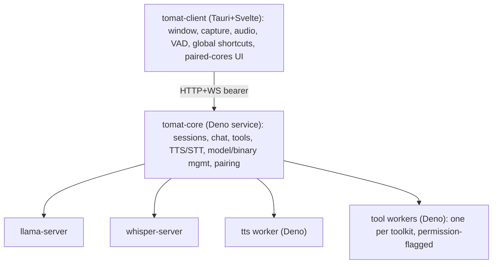

# Developing tomat

This document covers tomat's architecture and how to build and run it from
source. For the project's contribution policy, see
[CONTRIBUTING.md](CONTRIBUTING.md).

tomat is a local-first modular AI client. **tomat** runs the LLM,
speech-to-text, text-to-speech, and tool execution as a long-running service
(`tomat-core`) that can sit on the same machine as the UI or on a different one
(e.g. your gaming PC). The desktop client (`tomat-client`) is a small
Svelte+Tauri app that talks to one or more paired cores over an HTTP+WS API.

## Architecture at a glance



**Packages:**

- `packages/tomat-shared/`: TypeScript types + Zod schemas (API contract,
  `tools.json` schema, WS frame discriminated unions).
- `packages/tomat-core/`: Deno service, single SQLite DB, all sidecar
  supervision, npm-based toolkit installation, in-process embeddings.
- `packages/tomat-core-updater/`: standalone Rust binary that swaps in a staged
  core build during self-update, then restarts core.
- `packages/tomat-core-keychain/`: native Rust helper that stores the core's
  master key in the OS keychain over a stdio protocol.
- `packages/tomat-client/`: Tauri 2 + Svelte 5 + Vite + UnoCSS desktop UI.
- `packages/tomat-builtin-toolkit/`: the toolkit bundled with core; also a
  reference implementation of the `tools.json` format.
- `packages/tomat-website/`: Astro static site behind `au.tomat.ing` (landing
  page, signed manifests, install scripts, published JSON Schema).

## Setup

### Prerequisites

- **Deno 2.8+** (`brew install deno` / `winget install DenoLand.Deno` / see
  https://deno.com/).
- **Rust toolchain** for building the Tauri shell and the core-keychain helper
  (`packages/tomat-client/src/tauri/rust-toolchain.toml` pins the version).
- **Cargo + Tauri 2 prerequisites**: see
  https://v2.tauri.app/start/prerequisites/. On Debian/Ubuntu the full set
  (Tauri/webkit, PipeWire + ALSA for capture/audio, libsecret for the keychain
  helper) is:

  ```bash
  sudo apt-get install -y \
    libwebkit2gtk-4.1-dev libappindicator3-dev librsvg2-dev \
    libsoup-3.0-dev libpipewire-0.3-dev libasound2-dev \
    libsecret-1-dev patchelf
  ```

### First-time setup

```bash
deno install        # populates node_modules + warms the Deno npm cache
deno --version      # expect 2.8+
cargo --version     # expect 1.96.0 (pinned by rust-toolchain.toml)
```

`.env` at the repo root is **release-only** (manifest signing + Cloudflare/R2
credentials); it is **not** needed for `deno task dev` or `deno task test`. See
`.env.example` if you're setting up the release pipeline.

### Development

```bash
deno task dev       # spawns core (deno --watch) + client (tauri dev) together
```

The core listens on `127.0.0.1:7800` and the client UI runs at
`http://localhost:1420`. Output from each is prefixed `[core]` / `[client]`, and
`deno task dev` also prints a `[dev]` banner with a pairing code (below).

#### Connecting the client to the dev core

`deno task dev` runs the core from source, seeds a dev admin token at
`~/.tomat/dev/core/.admin-token`, and prints a pairing code. In the client's
first-run screen choose **"On another computer"**, enter the URL
`http://127.0.0.1:7800`, and paste the printed code. The pairing persists across
dev restarts. **Do not** click "On this computer" in dev. That path runs the
production installer (it looks for a compiled core binary, which dev never
builds) and would install a stable core over your dev session.

#### Channels & data isolation

State is namespaced by install channel via `TOMAT_CHANNEL`, so a dev or beta
build never collides with a stable install:

| `TOMAT_CHANNEL`  | data under         | keychain            |
| ---------------- | ------------------ | ------------------- |
| unset / `stable` | `~/.tomat/stable/` | `tomat-client`      |
| `dev`            | `~/.tomat/dev/`    | `tomat-client-dev`  |
| `beta`           | `~/.tomat/beta/`   | `tomat-client-beta` |

`deno task dev` sets `dev` automatically. Models are the one exception: they
stay shared at `~/.tomat/models` so multi-GB weights aren't re-downloaded per
channel. Reset dev state with `deno task clean --dev-state` (or
`rm -rf ~/.tomat/dev`); it never touches a stable install.

**Secrets in dev.** Core seals secrets (external API keys) in `secrets.enc` with
a master key kept in the OS keychain, falling back to a `chmod 600`
`~/.tomat/dev/core/.master-key` file when the keychain helper binary isn't built
(the usual dev case). If you delete that file (or the keychain entry) but keep
`secrets.enc`, the stored secrets can no longer be decrypted: core logs a loud
warning at startup and reads fail with a clear "master key mismatch". Preserve
`~/.tomat/dev/core/.master-key` across rebuilds, or just re-enter the secrets in
Settings. A full `--dev-state` reset clears both together, so it's unaffected.

Channels are built to **coexist and run at the same time**, not just isolate
data. Our binaries get a channel suffix (`tomat-core` → `tomat-core-beta`), the
desktop app is a distinct bundle (`tomat` vs `tomat-beta`, separate macOS
identifier), service labels are suffixed, and default ports are offset so two
cores can bind at once:

| channel | core | llama (`llm.port`) | whisper (`stt.port`) |
| ------- | ---- | ------------------ | -------------------- |
| stable  | 7800 | 7701               | 7702                 |
| beta    | 7810 | 7711               | 7712                 |
| dev     | 7820 | 7721               | 7722                 |

(Explicit settings still win; only the defaults shift.)

#### Building & releasing a beta

Build tasks keep a bare (stable) form; release tasks require an explicit
`:stable` / `:beta` channel (so a publish is never ambiguous):

```bash
deno task build:core:beta      # tomat-core-beta + updater + keychain
deno task build:client:beta    # tomat-beta app bundle
deno task release:beta         # umbrella: core + toolkit + client + scripts/schemas/website
deno task release:core:beta    # just the core manifest + binaries
deno task release:toolkit:beta # just the built-in toolkit manifest + tarball
deno task release:client:beta  # just the client bundle + manifest
```

Beta publishes to `manifests/beta/…` on the CDN and, for the sidecar binaries
(llama/whisper/deno), ships a _resolver_ in `binaries.json` so the running core
fetches the **latest upstream GitHub release** at install/update time (verified
against GitHub's sha256 digest), so upstream updates reach beta users without a
re-release. Stable stays pinned at release time.

### Cleaning build artifacts

```bash
deno task clean               # dist, target, build, .svelte-kit, .astro, .wrangler
deno task clean --deep        # also node_modules + the Deno cache (re-run deno install)
deno task clean --dev-state   # also ~/.tomat/dev (the isolated dev channel)
deno task clean --beta-state  # also ~/.tomat/beta (the isolated beta channel)
```

### Type-check + format + lint

```bash
deno task check     # deno check + svelte-check + cargo check
deno task fmt       # oxfmt (all TS/JS/JSON/MD) + cargo fmt
deno task lint      # oxlint (all TS/JS, incl. no-tauri-import plugin) + .svelte tauri grep + cargo clippy
```

### Tests

```bash
deno task test          # Deno + vitest + cargo test
deno task test:ui       # vitest against the Svelte UI
deno task test:rs       # cargo test for the Rust crates
deno task test:e2e      # WebdriverIO E2E (manual, opt-in)
```

Tests are co-located with source as `*.test.ts`. E2E specs live under
`tests/e2e/specs/` with their own runner; see
[tests/e2e/README.md](tests/e2e/README.md) for setup. Scratch tests are
`*.tmp.test.ts` (gitignored anywhere in the tree). The developer guide for the
suite (helpers, fixtures, mocking patterns) is in
[tests/README.md](tests/README.md).

## Installing the core on another device

To control a different machine, install `tomat-core` on it (the desktop client's
pairing screen links here). The installer is a single command:

```bash
# macOS / Linux
curl -fsSL https://au.tomat.ing/install/core.sh | bash

# Windows (PowerShell)
powershell -ExecutionPolicy Bypass -Command "iwr -useb https://au.tomat.ing/install/core.ps1 | iex"
```

To install the **beta** channel alongside stable, pass `--beta` (or
`TOMAT_CHANNEL=beta`); it installs `tomat-core-beta`, a `tomat-core-beta`
service, and binds port 7810:

```bash
# macOS / Linux
curl -fsSL https://au.tomat.ing/install/core.sh | bash -s -- --beta
# Windows (PowerShell)
powershell -ExecutionPolicy Bypass -Command "& { $env:TOMAT_CHANNEL='beta'; iwr -useb https://au.tomat.ing/install/core.ps1 | iex }"
```

The installer downloads the signed core manifest, verifies the binary's SHA-256,
installs an auto-start service (launchd / systemd-user / Task Scheduler), starts
the daemon, and prints a 6-digit pairing code. Open the client, paste the core's
URL (e.g. `http://192.168.1.50:7800`) and the pairing code. The client receives
a long-lived bearer token, stored in your OS keychain under the service
`tomat-client`.

A single client can pair with multiple cores and switch between them via a
dropdown in Settings. A single core can serve multiple clients simultaneously.
Sessions are owned by the client that created them and are invisible to other
paired clients.

## Toolkits

Toolkits are npm packages with a `tools.json` at their root (see
[`packages/tomat-shared/src/tools-json-schema.json`](packages/tomat-shared/src/tools-json-schema.json)).
The format is an open standard: any host that understands `tools.json` can load
them. Core discovers toolkits by searching npm for the `tools-available`
keyword, and ships with a built-in toolkit
([`packages/tomat-builtin-toolkit/`](packages/tomat-builtin-toolkit/)) that
doubles as a worked example. Each tool declares the OS-level permissions it
needs (network hosts, filesystem paths, executables, env vars, FFI, sys flags);
the user grants permissions per tool, and the worker subprocess is spawned with
exactly the matching Deno `--allow-*` flags.
