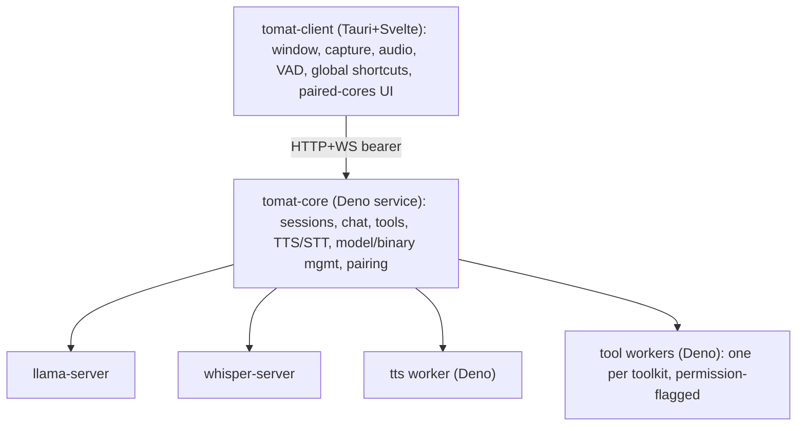

# Developing Tomat

This document covers Tomat's architecture and how to build and run it from
source. For the project's contribution policy, see
[CONTRIBUTING.md](CONTRIBUTING.md).

Tomat is a local-first modular AI client. **Tomat** runs the LLM,
speech-to-text, text-to-speech, and tool execution as a long-running service
(`tomat-core`) that can sit on the same machine as the UI or on a different one
(e.g. your gaming PC). The desktop client (`tomat-client`) is a small
Svelte+Tauri app that talks to one or more paired cores over an HTTP+WS API.

## Architecture at a glance



**Packages:**

- `packages/tomat-shared/`: TypeScript types + Zod schemas (API contract,
  `tools.json` schema, WS frame discriminated unions).
- `packages/tomat-core/`: Deno service, single SQLite DB, all sidecar
  supervision, npm-based toolkit installation, in-process embeddings.
- `packages/tomat-core-updater/`: standalone Deno binary that swaps in a staged
  core build during self-update, then restarts core.
- `packages/tomat-core-keychain/`: native Rust helper that stores the core's
  master key in the OS keychain over a stdio protocol.
- `packages/tomat-client/`: Tauri 2 + Svelte 5 + Vite + UnoCSS desktop UI.
- `packages/tomat-builtin-toolkit/`: the toolkit bundled with core; also a
  reference implementation of the `tools.json` format.
- `packages/tomat-website/`: Astro static site behind `au.tomat.ing` (landing
  page, signed manifests, install scripts, published JSON Schema).

## Setup

### Prerequisites

- **Deno 2.7+** (`brew install deno` / `winget install DenoLand.Deno` / see
  https://deno.com/).
- **Rust toolchain** for building the Tauri shell and the core-keychain helper
  (`packages/tomat-client/src/tauri/rust-toolchain.toml` pins the version).
- **Cargo + Tauri 2 prerequisites**: see
  https://v2.tauri.app/start/prerequisites/.

### First-time setup

```bash
deno install        # populates node_modules + warms the Deno npm cache
```

### Development

```bash
deno task dev       # spawns core (deno --watch) + client (tauri dev) together
```

The core listens on `127.0.0.1:7800` and the client UI runs at
`http://localhost:1420`. Output from each is prefixed `[core]` / `[client]`.

### Type-check + format + lint

```bash
deno task check     # deno check + svelte-check + cargo check
deno task fmt       # deno fmt + oxfmt + cargo fmt
deno task lint      # deno lint + oxlint + cargo clippy
```

### Tests

```bash
deno task test          # Deno + vitest + cargo test
deno task test:ui       # vitest against the Svelte UI
deno task test:rs       # cargo test for the Rust crates
deno task test:e2e      # WebdriverIO E2E (manual, opt-in)
deno task test:coverage # all of the above with lcov output
```

Tests are co-located with source as `*.test.ts`. E2E specs live under
`tests/e2e/specs/` with their own runner — see
[tests/e2e/README.md](tests/e2e/README.md) for setup. Scratch tests are
`*.tmp.test.ts` (gitignored anywhere in the tree). The developer guide for the
suite (helpers, fixtures, mocking patterns) is in
[tests/README.md](tests/README.md).

## Installing the core on another device

To control a different machine, install `tomat-core` on it (the desktop client's
pairing screen links here). The installer is a single command:

```bash
# macOS / Linux
curl -fsSL https://au.tomat.ing/install/core.sh | bash

# Windows (PowerShell)
powershell -ExecutionPolicy Bypass -Command "iwr -useb https://au.tomat.ing/install/core.ps1 | iex"
```

The installer downloads the signed core manifest, verifies the binary's SHA-256,
installs an auto-start service (launchd / systemd-user / Task Scheduler), starts
the daemon, and prints a 6-digit pairing code. Open the client, paste the core's
URL (e.g. `http://192.168.1.50:7800`) and the pairing code. The client receives
a long-lived bearer token, stored in your OS keychain under the service
`tomat-client`.

A single client can pair with multiple cores and switch between them via a
dropdown in Settings. A single core can serve multiple clients simultaneously.
Sessions are owned by the client that created them and are invisible to other
paired clients.

## Toolkits

Toolkits are npm packages with a `tools.json` at their root (see
[`packages/tomat-shared/src/tools-json-schema.json`](packages/tomat-shared/src/tools-json-schema.json)).
The format is an open standard: any host that understands `tools.json` can load
them. Core discovers toolkits by searching npm for the `tools-available`
keyword, and ships with a built-in toolkit
([`packages/tomat-builtin-toolkit/`](packages/tomat-builtin-toolkit/)) that
doubles as a worked example. Each tool declares the OS-level permissions it
needs (network hosts, filesystem paths, executables, env vars, FFI, sys flags);
the user grants permissions per tool, and the worker subprocess is spawned with
exactly the matching Deno `--allow-*` flags.
