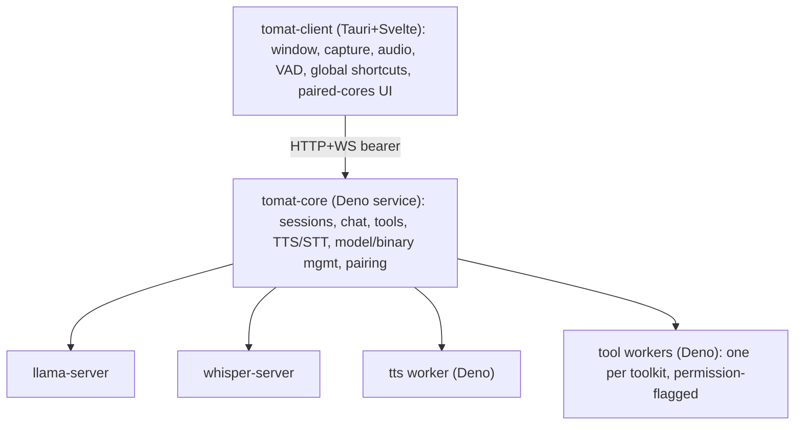

# Developing tomat

This document covers tomat's architecture and how to build and run it from
source. For the project's contribution policy, see
[CONTRIBUTING.md](CONTRIBUTING.md). Each package has its own README with the
deeper detail; this file stays at the getting-started level.

tomat is a local-first modular AI client. **tomat** runs the LLM,
speech-to-text, text-to-speech, and tool execution as a long-running service
(`tomat-core`) that can sit on the same machine as the UI or on a different one
(e.g. your gaming PC). The desktop client (`tomat-client`) is a small
Svelte+Tauri app that talks to one or more paired cores over an HTTP+WS API.

## Architecture at a glance



**Packages** (each links to its own README for layout and internals):

- [`packages/tomat-shared/`](packages/tomat-shared/README.md): TypeScript
  types + Zod schemas (API contract, `tools.json` schema, WS frame
  discriminated unions).
- [`packages/tomat-core/`](packages/tomat-core/README.md): Deno service,
  single SQLite DB, all sidecar supervision, npm-based toolkit installation,
  in-process embeddings.
- [`packages/tomat-core-updater/`](packages/tomat-core-updater/README.md):
  standalone Rust binary that swaps in a staged core build during self-update,
  then restarts core.
- [`packages/tomat-core-keychain/`](packages/tomat-core-keychain/README.md):
  native Rust helper that stores the core's master key in the OS keychain over
  a stdio protocol.
- [`packages/tomat-core-hwinfo/`](packages/tomat-core-hwinfo/README.md):
  native Rust helper that reports RAM, physical cores, and GPU/VRAM for the
  on-device model fit engine.
- [`packages/tomat-client/`](packages/tomat-client/README.md): Tauri 2 +
  Svelte 5 + Vite + UnoCSS desktop UI.
- [`packages/tomat-model-catalog/`](packages/tomat-model-catalog/README.md):
  hand-authored source for the signed model catalog that drives the model
  pickers in Settings.
- [`packages/tomat-builtin-toolkit/`](packages/tomat-builtin-toolkit/README.md):
  the toolkit bundled with core; also a reference implementation of the
  `tools.json` format and the toolkit author docs.
- [`packages/tomat-website/`](packages/tomat-website/README.md): Astro site
  behind `au.tomat.ing` (landing page only), plus the release + deploy
  pipeline for the artifacts served from `get.au.tomat.ing`.

## Setup

### Prerequisites

- **Deno 2.8+** (`brew install deno` / `winget install DenoLand.Deno` / see
  https://deno.com/).
- **Rust toolchain** for building the Tauri shell and the core-keychain helper
  (`packages/tomat-client/src/tauri/rust-toolchain.toml` pins the version).
- **Cargo + Tauri 2 prerequisites**: see
  https://v2.tauri.app/start/prerequisites/. On Debian/Ubuntu the full set
  (Tauri/webkit, PipeWire + ALSA for capture/audio, libsecret for the keychain
  helper) is:

  ```bash
  sudo apt-get install -y \
    libwebkit2gtk-4.1-dev libappindicator3-dev librsvg2-dev \
    libsoup-3.0-dev libpipewire-0.3-dev libasound2-dev \
    libsecret-1-dev patchelf
  ```

### First-time setup

```bash
deno install        # populates node_modules + warms the Deno npm cache
deno --version      # expect 2.8+
cargo --version     # expect 1.96.0 (pinned by rust-toolchain.toml)
```

`.env` at the repo root is **release-only** (manifest signing + Cloudflare/R2
credentials); it is **not** needed for `deno task dev` or `deno task test`. See
`.env.example` if you're setting up the release pipeline.

## Development loop

```bash
deno task dev       # spawns core (deno --watch) + client (tauri dev) together
```

The core listens on `127.0.0.1:7800` and the client UI runs at
`http://localhost:1420`. Output from each is prefixed `[core]` / `[client]`, and
`deno task dev` also prints a `[dev]` banner with a pairing code (below).

### Connecting the client to the dev core

`deno task dev` runs the core from source, seeds a dev admin token at
`~/.tomat/dev/core/.admin-token`, and prints a pairing code. In the client's
first-run screen choose **"On another computer"**, enter the URL
`http://127.0.0.1:7800`, and paste the printed code. The pairing persists across
dev restarts. **Do not** click "On this computer" in dev. That path runs the
production installer (it looks for a compiled core binary, which dev never
builds) and would install a stable core over your dev session.

### Cleaning build artifacts

```bash
deno task clean               # dist, target, build, .svelte-kit, .astro, .wrangler
deno task clean --deep        # also node_modules + the Deno cache (re-run deno install)
deno task clean --dev-state   # also ~/.tomat/dev (the isolated dev channel)
deno task clean --beta-state  # also ~/.tomat/beta (the isolated beta channel)
```

## Channels

State is namespaced by install channel via `TOMAT_CHANNEL`, so a dev or beta
build never collides with a stable install:

| `TOMAT_CHANNEL`  | data under         | keychain            |
| ---------------- | ------------------ | ------------------- |
| unset / `stable` | `~/.tomat/stable/` | `tomat-client`      |
| `dev`            | `~/.tomat/dev/`    | `tomat-client-dev`  |
| `beta`           | `~/.tomat/beta/`   | `tomat-client-beta` |

`deno task dev` sets `dev` automatically. Models are the one exception: they
stay shared at `~/.tomat/models` so multi-GB weights aren't re-downloaded per
channel. Reset dev state with `deno task clean --dev-state` (or
`rm -rf ~/.tomat/dev`); it never touches a stable install. How core stores
secrets in dev (and how not to lose them) is covered in
[packages/tomat-core/README.md](packages/tomat-core/README.md).

Channels are built to **coexist and run at the same time**, not just isolate
data: binaries get a channel suffix (`tomat-core` → `tomat-core-beta`), the
desktop app is a distinct bundle, service labels are suffixed, and default
ports are offset so two cores can bind at once:

| channel | core | llama (`llm.port`) | whisper (`stt.port`) |
| ------- | ---- | ------------------ | -------------------- |
| stable  | 7800 | 7701               | 7702                 |
| beta    | 7810 | 7711               | 7712                 |
| dev     | 7820 | 7721               | 7722                 |

(Explicit settings still win; only the defaults shift.)

Building and releasing a beta (or stable) is covered in
[packages/tomat-website/README.md](packages/tomat-website/README.md), the
release + deploy doc.

## Type-check + format + lint

```bash
deno task check     # deno check + svelte-check + cargo check
deno task fmt       # oxfmt (all TS/JS/JSON/MD) + cargo fmt
deno task lint      # oxlint (all TS/JS, incl. no-tauri-import plugin) + .svelte tauri grep + cargo clippy
```

## Tests

```bash
deno task test          # Deno + vitest + cargo test
deno task test:ui       # vitest against the Svelte UI
deno task test:rs       # cargo test for the Rust crates
deno task test:e2e      # WebdriverIO E2E (manual, opt-in)
```

Tests are co-located with source as `*.test.ts`. E2E specs live under
`tests/e2e/specs/` with their own runner; see
[tests/e2e/README.md](tests/e2e/README.md) for setup. Scratch tests are
`*.tmp.test.ts` (gitignored anywhere in the tree). The developer guide for the
suite (helpers, fixtures, mocking patterns) is in
[tests/README.md](tests/README.md).
